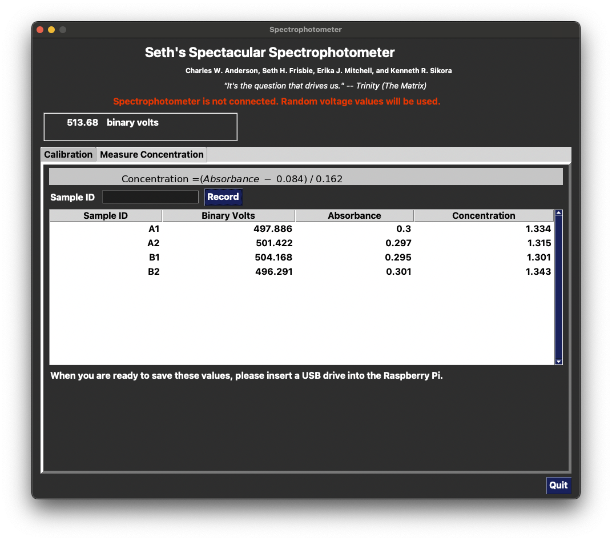

# Spectrophotometer 

<!--
<div>
  <p align="center">
     
  </p>
</div>
-->

The repository contains Python code to run on a Raspberry Pi that provides an
interface for Dr. Seth Frisbie's spectrophotometer device.

The latest update (March 22, 2025) can be installed on a Raspberry Pi by downloading `install.sh` and `spectro.zip` directly to a Pi, or to a USB stick to copy onto a Pi.  Then run `bash install.sh` and an icon with mutiple test tubes should appear on the Desktop.  Double click this to run!

Details to be provided soon.

<!--
ThePhish is an automated phishing email analysis tool based on [TheHive](https://github.com/TheHive-Project/TheHive), [Cortex](https://github.com/TheHive-Project/Cortex/) and [MISP](https://github.com/MISP/MISP). It is a web application written in Python 3 and based on Flask that automates the entire analysis process starting from the extraction of the observables from the header and the body of an email to the elaboration of a verdict which is final in most cases. In addition, it allows the analyst to intervene in the analysis process and obtain further details on the email being analyzed if necessary. In order to interact with TheHive and Cortex, it uses [TheHive4py](https://github.com/TheHive-Project/TheHive4py) and [Cortex4py](https://github.com/TheHive-Project/Cortex4py), which are the Python API clients that allow using the REST APIs made available by TheHive and Cortex respectively.


[](https://www.python.org/)
[](https://github.com/emalderson/ThePhish/tree/master/docker)
[](https://github.com/emalderson/ThePhish)
[](https://github.com/emalderson/ThePhish/blob/master/LICENSE)
[](https://github.com/emalderson/ThePhish)

-->

## Table of contents

* [Overview](#overview)
* [How to Use](#how-to-use)
* [Implementation](#implementation)
* [Installation](#installation)
* [License](#license)
* [Academic publications](#academic-publications)
* [Credits](#credits)


## Overview

Coming soon.

## How to Use

After installing the `src/*.py` onto the Raspberry Pi, launch the code
with `python spectrophotometer.py`.  You should see the following
window.


After clicking on OK you will go to a window in which you can record
sensor readings from several samples.  When done, you will go to a
window like this.


If you choose to "Use" this calibration equation, you will advance
to the following screen where you can type a sample ID, place the
sample in the spectrophotometer, and click "Record". The result will
be entered in the table.  When done, you can insert a USB drive into 
the Raspberry Pi and save this table into a csv file on the drive.

 

If your initial calibration samples are not fit well with a linear or
quadratic formula, a cubic formula is tried.  Here is an example.


## Implementation

Coming soon.

## Installation

Use  [rpi-imager](https://www.raspberrypi.com/software/)  to install 64 bit version with desktop

Set up user   `spectro`   with password   `cleanwater4all`

```
pip install scipy
pip install tk
pip install adafruit_3008

python spectrophotometer.py
```

In Desktop, create  `Spectrophotometer.desktop`   file containing:

```
[Desktop Entry]
Name=Spectrophotometer
Comment=Python code to interface with Dr. Seth Frisbie's Spectrophotometer via a Raspberry Pi
Icon=/home/spectro/testtube.jpg
Exec=python /home/spectro/spectrophotometer.py
Type=Application
Terminal=false
StartupNotify=false
```

Then in the file manager (nautilus), select this .desktop file, then under Edit, Preferences, General, and check the box for "Don't ask options on launch of executable file"


## License

Coming soon.

<!--

ThePhish is an open-source and free software released under the [AGPL](https://github.com/emalderson/ThePhish/blob/master/LICENSE) (Affero General Public License).

-->

## Academic publications

Coming soon.

## Credits

Coming soon.
